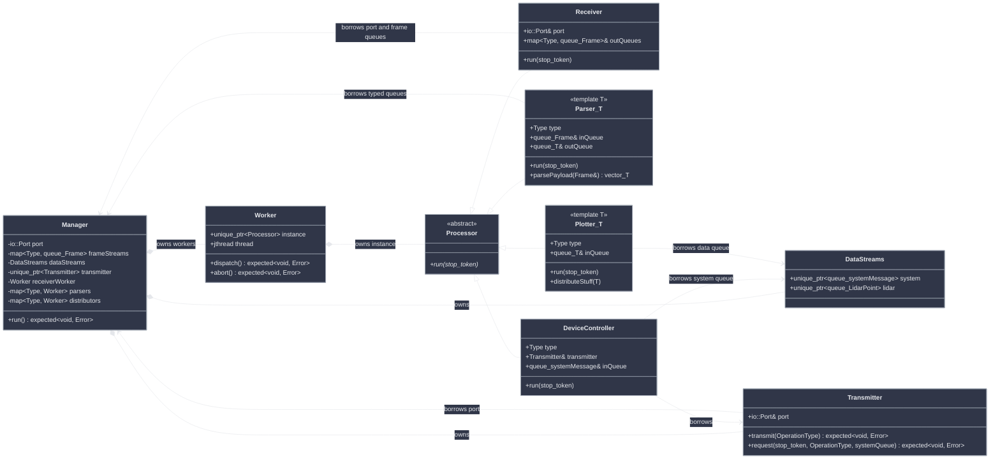
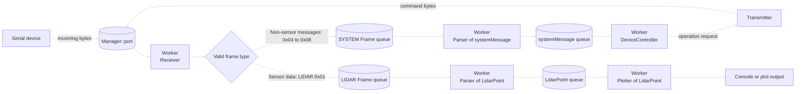
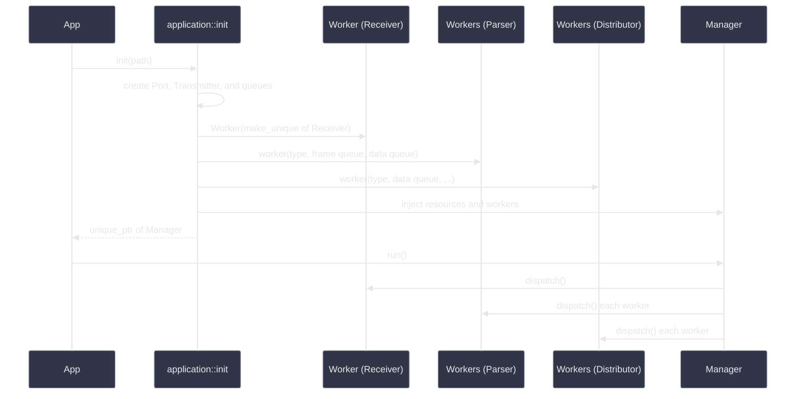

# Architecture

This document describes the current implementation, including ownership, worker lifecycle, and data flow.

## Class Diagram



`worker::Worker` owns one `processor::Processor` instance and its `std::jthread`. Receivers, parsers, and distributors inherit from `Processor` and implement `run(std::stop_token)`. The constructor accepts a `std::unique_ptr<Processor>`; `dispatch()` and `abort()` return `WORKER_DISPATCH_FAILED` if the instance is missing.

```cpp
worker::Worker receiver(std::make_unique<receiver::Receiver>(*port, *frameStreams));
std::map<frame::Type, worker::Worker> parsers;
std::map<frame::Type, worker::Worker> distributors;
```

## Data Flow



The intended routing sends valid sensor data to its sensor-specific Frame queue and all non-sensor messages to the SYSTEM Frame queue. The currently defined non-sensor wire types are INITIALIZING (`0x04`), DEVICE_INFO (`0x05`), HEALTH_STATUS (`0x06`), READY (`0x07`), and STARTUP_FAILED (`0x08`). LIDAR (`0x01`) is the only sensor path with a queue and parser today; IMU (`0x02`) and Encoder (`0x03`) would need their own sensor paths when supported.

The SYSTEM routing shown above is not implemented yet. `Receiver` currently uses the wire type directly as the `frameStreams` key, so types `0x04` through `0x08` create queues without a parser instead of reaching the SYSTEM queue. This remains part of [issue #1](https://github.com/kei185/my-plot/issues/1).

`Manager` owns one `io::Port`. `Receiver` reads incoming bytes from its POSIX file descriptor, while `Transmitter` writes commands through the same port.

## Initialization and Execution



`application::init()` constructs processors and workers, then passes the resources and workers into `Manager` through its constructor. Threads are started later by `Manager::run()` through `Worker::dispatch()`.

## Shutdown

`Worker::abort()` requests cancellation through the worker's `std::jthread`. The `jthread` destructor subsequently joins the thread. Every component must check its `std::stop_token` regularly and return after cancellation is requested.

## Current Limitations

- The queues are accessed from multiple threads, but `std::queue` is not thread-safe. A synchronized queue abstraction is still required.
- Empty queues are polled continuously, creating busy-wait loops. A condition variable or blocking queue would avoid unnecessary CPU use.
- `frameStreams` and the queues inside `DataStreams` are heap-allocated even though `Manager` has sole ownership. They could be stored directly unless stable indirection is required.
- Initialization is listed explicitly for every frame type. This is verbose, but keeps the mapping between frame type, parsed data type, and distributor visible.
